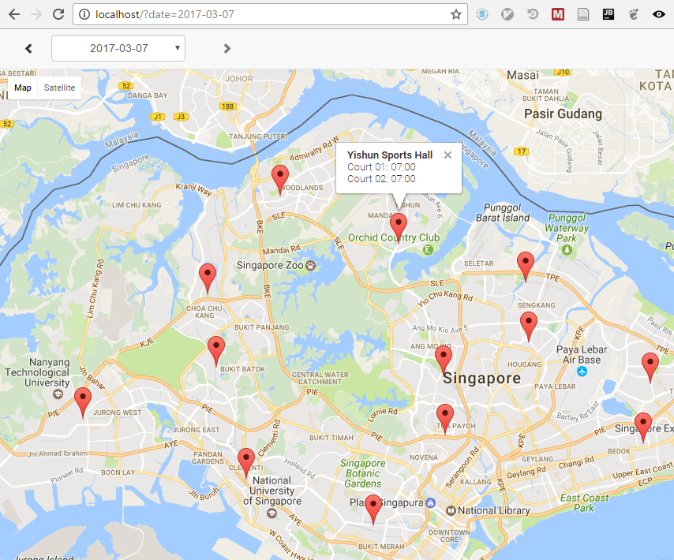

# ActiveSG
Query free badminton slots on www.myactivesg.com the easy way.

Currently to check availability on MyActiveSG, we have to select a particular activity, venue and date _one-by-one_. Although it works, it can be quite slow and annoying to have to do this for all the venues and dates we are interested in.

This tool checks the availability in the background for you. When it's done you can view the result on the web browser quickly.

## Requirements
1. Python 3.6  
   Requests made by earlier versions of python seems to give such error: `The server cannot understand the request.` Seems to have something to do with the encryption library or requests library of earlier Python
2. Python requests, crypto and BeautifulSoup libraries  
   For the crypto library, if installed using pip, normally it requires compilation from crypto source code and this requires you to setup Python development tools and so on. An easier way is to install Python distribution from [Anaconda](https://www.continuum.io/downloads) which already includes all the necessary libraries.
3. Google Maps API key (to view the result in the map). You can get it from [here](https://developers.google.com/maps/documentation/javascript/get-api-key).

## How to run
1. Change directory to activesg
2. Execute the following command: `python activesg.py -u <username>`
3. It will prompts you for password  
   Alternatively, if you don't want to always enter username and password. Put them in these environment variables: `ACTIVESG_EMAIL` and `ACTIVESG_PASSWORD`. Then you can just execute `python activesg.py`.
4. After it finished, you can stop the result. The result is stored in html/availability.json
5. Edit html/index.html and replace `REPLACE_WITH_YOUR_API_KEY` with your Google Maps API key
5. You can go change directory to `html` folder then start a web server: `python -m http.server 80`
